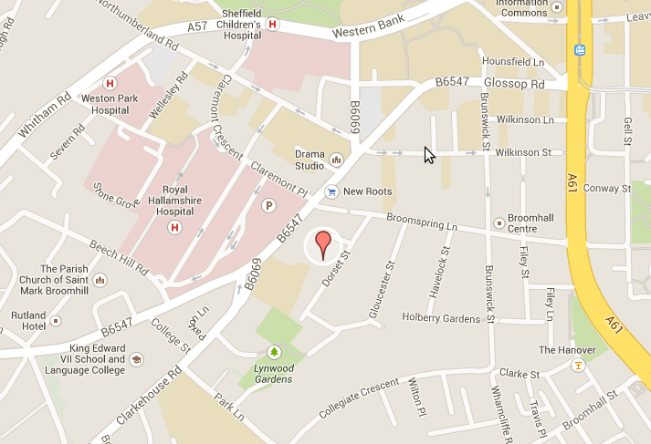

[PDF Version of this Document for Printing](pdf/accommodation.pdf)

All talks will be given at the Sheffield Institute for Translational
Neuroscience (see map below). Some suggestions for accommodation close
to the institute:

1.  [University accommodation](http://withus.com/conferencewithus/bookingpage/) (it
    will sometimes be unavailable depending on term times).
2.  [Rutland Hotel](http://www.rutlandhotel-sheffield.com/)
3.  [Westbourne Hotel](http://www.westbournehousehotel.com/)
4.  [Etruria House Hotel](http://etruriahouse.com/)
5.  "Best Western Cutlers" (not so close but there's a convenient tram /
    bus service).

[More suggestions here](http://www.sheffield.ac.uk/polopoly_fs/1.303478!/file/Hotels.pdf)

Notice that the above document lists accommodation in location order
from the main campus and not from SITraN (where the event will take
place), so you might want to also consult a map (see below).

Sheffield Institute for Translational Neuroscience,
385A Glossop Road,
S10 2HQ, Sheffield, UK

Details of accommodation availability for upcoming schools will appear
here.

[SITraN, Map](https://mapsengine.google.com/map/edit?mid=zlMmxR9AWVCE.ksPn_xZ3BtB8)

