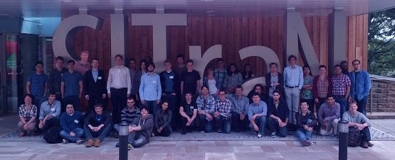

University of Sheffield
 10 - 12 June 2013

## Monday 10 June

  8:00-9:00     *arrivals*                                  
  
  9:00-10:30    **Neil Lawrence**, Univ. of Sheffield      Introduction to GPs ([pdf](talks/Sheffield-GPSS2013-Lawrence1.pdf))
  
                *coffee break*                              
  
  11:00-12:30   **Richard Turner**, Univ. of Cambridge     Introduction to GPs ([pdf](talks/Sheffield-GPSS2013-Turner.pdf))
  
                *lunch*                                     
  
  13:30-15:30   lab session                                GP models with GPy ([pdf](labs/lab1.pdf))
  
                *coffee break*                              
  
  16:00-17:30   **Nicolas Durrande**, Univ. of Sheffield   Kernel design ([pdf](talks/Sheffield-GPSS2013-Durrande.pdf))
  

## Tuesday 11 June

  9:00-10:30    **Neil Lawrence**, Univ. of Sheffield        Multi-output GPs ([pdf](talks/Sheffield-GPSS2013-Lawrence2.pdf))
  
                *coffee break*                                
  
  11:00-12:00   **James Hensman**, Univ. of Sheffield        Sparse GPs ([pdf](talks/Sheffield-GPSS2013-Hensman.pdf))
  
  12:00-12:30   **Ricardo Andrade**, Univ. of Sheffield      Expectation propagation ([pdf](talks/Sheffield-GPSS2013-Andrade.pdf))
                *lunch*                                       
  13:30-15:30   lab session                                  Sparse GPs with GPy ([pdf](labs/lab2.pdf), [dataset](labs/lab2-dataset.zip))
  
                *coffee break*                                
  16:00-17:30   **Richard Wilkinson**, Univ. of Nottingham   GPs for uncertainty quantification in computer experiments ([pdf](talks/Sheffield-GPSS2013-Wilkinson.pdf))

## Wednesday 12 June

  9:00-10:00    **Michael Osborne**, Univ. of Oxford    GPs for optimisation ([pdf](talks/Sheffield-GPSS2013-Osborne.pdf))
  
                *coffee break*                           
  
  10:30-11:30   **Philipp Hennig**, MPI Tuebingen       GPs for optimisation ([pdf](talks/Sheffield-GPSS2013-Hennig.pdf))
  
  11:30-12:30   **Neil Lawrence**, Univ. of Sheffield   GPs latent variable models ([pdf](talks/Sheffield-GPSS2013-Lawrence3.pdf))
  
                *lunch*                                  
  
  13:30-15:30   lab session                             Latent variable models with GPy ([pdf](labs/lab3.pdf), [dataset](labs/lab3-dataset.zip))
  
                *coffee break*                           
  
  16:00-17:30   **Simo Särkkä**, Univ. of Aalto         State space representation of GPs ([pdf](talks/Sheffield-GPSS2013-Sarkka.pdf))
